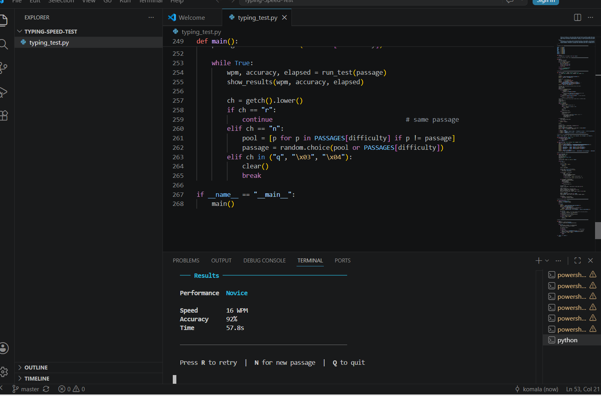

# ⌨️ Typing Speed Test

## 📌 Description
This is a Python-based Typing Speed Test application that measures typing speed and accuracy.

## 🚀 Features
- Random sentence generation
- Real-time typing detection
- Speed calculation (WPM)
- Accuracy calculation

## 🧠 Concepts Used
- Keyboard Events
- Time Measurement
- Tkinter GUI

## 🖼️ Screenshot

## ▶️ How to Run
1. Install Python
2. Run:
   python typing_test.py
